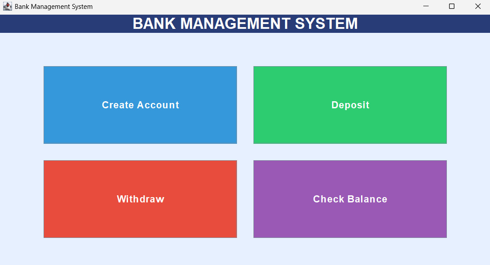
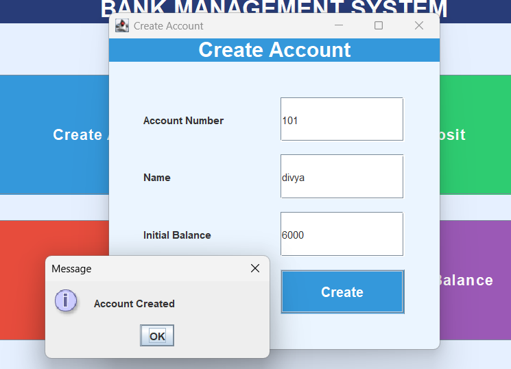
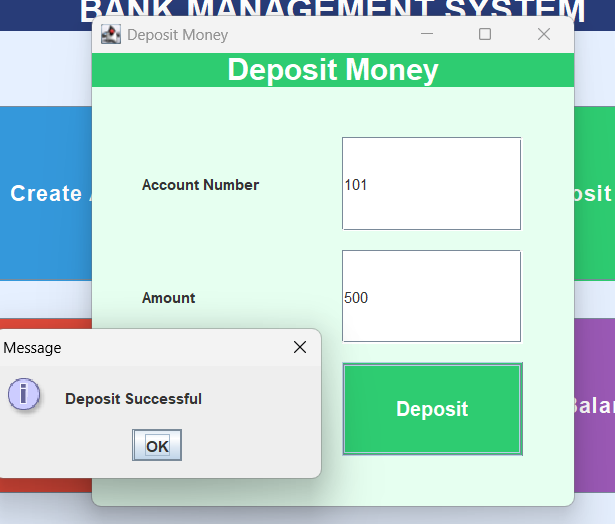

# Bank Management System (Java Swing)

A clean and interactive **Bank Management System** developed using **Java Swing**.
This project demonstrates core Java concepts through a graphical user interface.

---

## 🚀 Features

* Create Account
* Deposit Money
* Withdraw Money
* Check Balance
* Separate windows for each operation
* Colorful and structured GUI

---

## 🛠️ Technologies Used

* Java
* Java Swing (GUI)
* Object-Oriented Programming (OOP)
* ArrayList (Java Collections)

---

## 📂 Project Structure

```id="psv7b2"
BankSystem/
│
├── Main.java
├── model/
├── service/
└── ui/
```

---

## ▶️ How to Run

```id="zfq7dl"
javac Main.java ui/*.java service/*.java model/*.java
java Main
```

---
## 📸 Screenshots







---
## 🎯 Highlights

* Modular structure (model, service, ui)
* Event-driven programming using ActionListener
* Clean GUI design using Swing
* No database (pure Core Java project)

---

## 🔮 Future Enhancements

* Add database integration (MySQL)
* Add login/authentication system
* Store transaction history
* Improve UI with dashboard layout

---


## 👩‍💻 Author

**[Kotturu Divya]**  
B.Tech Data Science Student  
Anurag University
